# wholeBrain imaging paper

The goal of this work is to provide a broad description of the population activity patterns that occur in developing cerebral cortex.

The main manuscript file is **[wholeBrain_main.md][]**

## Rationale
The idea is to provide a clear and beautiful representation of the visualized activity patterns within developing brain in vivo.

### Scientific importance
A comprehensive description of the spatiotemporal activity patterns in the immature brain will be crucial to understanding the developmental dynamics that exist between intrinsic and extrinsic factors that regulate circuit development. 

Indeed one of the fundamental goals of the BRAIN Initiative funded by NIH, NSF, and DARPA is provide dynamic maps of the brains electrical activity at an intermediate scale that bridges the local and global assessments garnered through current technologies in animals and humans. [NIH BRAIN working group interim report](http://acd.od.nih.gov/ACD-BRAIN-Working-Group-Report.pdf)

* signature patterns that predict current or future behavior
* construction of self-organizing circuits (advanced robotics -- *Terminators, Skynet, & Cylons!*)

### Human health importance
* neurodevelopmental disorders (autism, schizophrenia, epilepsy)
* activity-dependent structural plasticity. Implications for brain repair.
* development of brain-machine interfaces

### Previous work 

reference                              | FOV info                                                                                                                                                                  | figure snapshot                                       
-------------------------------------- | ------------------------------------------------------------------------------------------------------------------------------------------------------------------------- | ------------------------------------------------------  
[Yuste et al.][#Yuste:1992]            | calcium imaging in tangential slices of barrel cortex L4 from P4-5 rats in figure2, and from somatosensory, visual and frontal cortices in general with coronal or tangential slices from P0-7. **500 x 575 µm FOV**. Mean domain size was 96 µm. 50 -120µm range. 'We found no differences in the size, shape, or frequency of domains in different cortical areas.'                               | 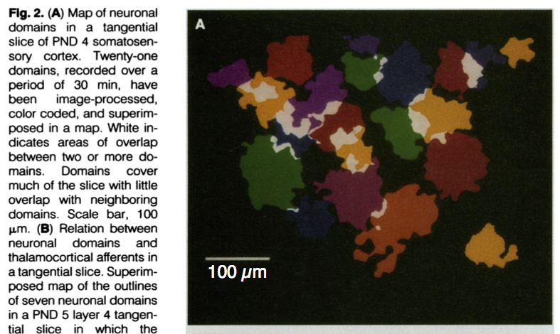
[Chiu & Weliky][#Chiu:2001]            | linear MEA covering a **3.2 mm strip** across visual cortex Corr activity observed between cortical patches separated by mean distance of 1 mm                            | 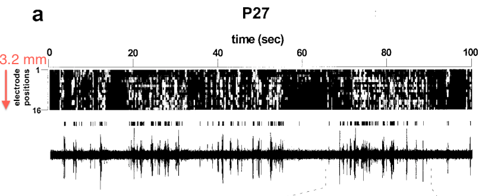
[Hanganu et al][#Hanganu:2006]         | single electrodes or 4 shank linear MEAs placed in each hemisphere (0.5-1.0mm spacing, for **1.5-3.0mm total**)                                                           | 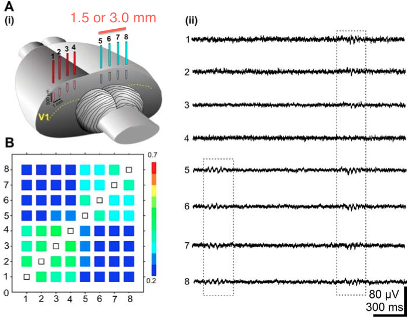
[Adelsberger et al][#Adelsberger:2005] | optical fiber implant for freely moving neonatal mice with bulk loading, 400µm diameter FOV imaged in TeA or Ent                                                         | 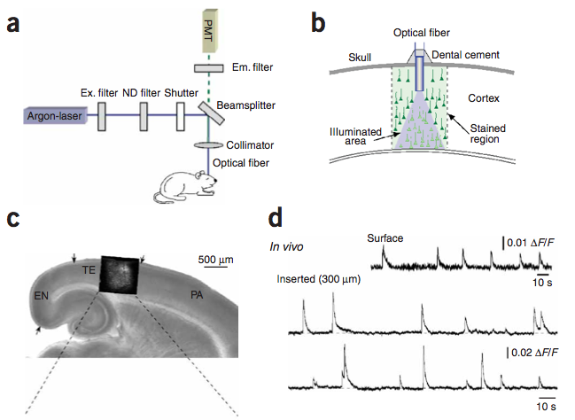
[Rochefort et al][#Rochefort:2009]     | 100x70µm FOV 2P-MCI in mouse visual cortex at P11                                                                                                                        | 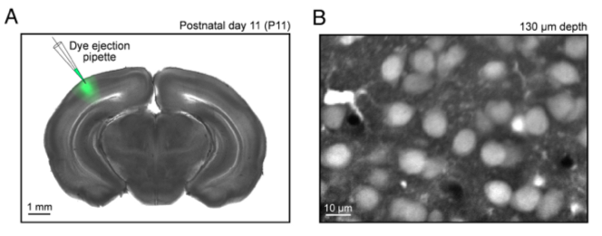
[Colonnese et al.][#Colonnese:2010]    | single pulled electrodes in V1 or linear MEA (16 site silcon probe, 4sites x 4shanks, with 200µm separation, **600µm total**                                            | 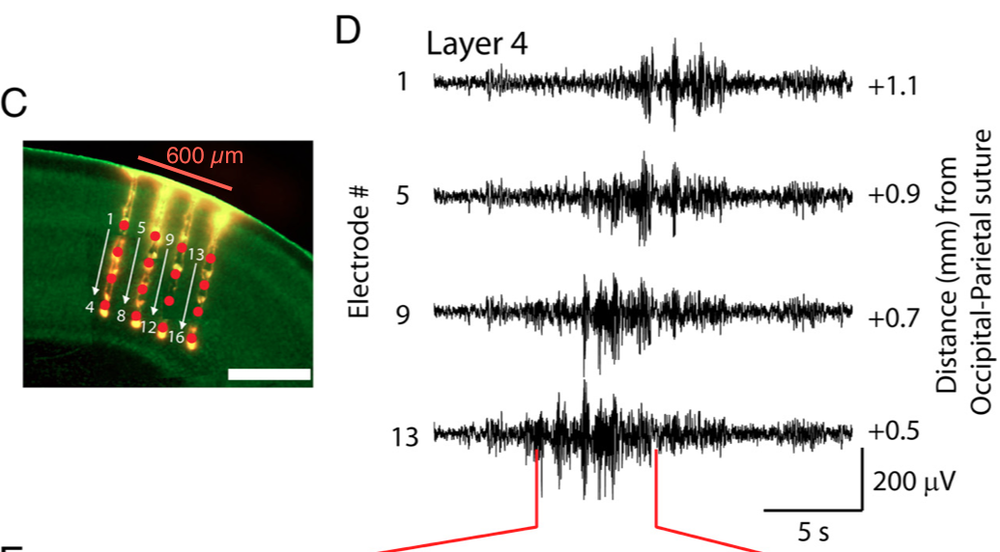
[Siegel et al.][#Siegel:2012]          | **219x180 µm FOV** 2P-MCI in visual cortex                                                                                                                               | 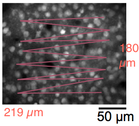
[Ackman et al][#Ackman:2012]           | **3.0 x 4.0 mm FOV** WF-MCI in V1, V2, and SC P3-P9 mouse                                                                                                                 | 
[Leinekugel et al][#Leinekugel:2002]   | P4-6 rat hippocampus, cortex, 8 tip linear MEA (tungsten wires), 100-300µm vertical tip separation                                                                       | 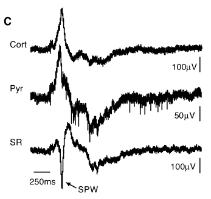
[Khazipov et al][#Khazipov:2004a]      | P1-6 rat somatosensory cortex, single electrode MUA and PC                                                                                                                | 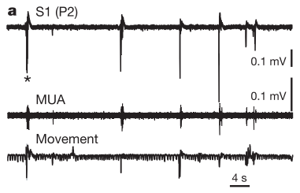
[Yang et al][#Yang:2009]               | 4x4 linear MEA 200µm spacing, **600µm total**, bilaterally in S1 barrel cortex                                                                                          | 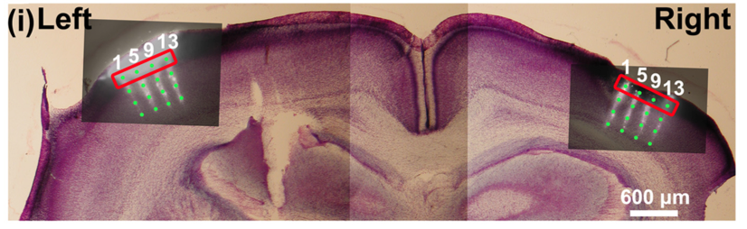
[Yang et al][#Yang:2012a]              | **2.6 x 2.6 mm FOV**, VSD imaging in S1 cortex P0-7 rat. Spont and evoked activity in C2 barrel. 8shank x 4site silicon probe linear MEA (200µm separation, 1.4mm total). Activations were 300-400µm diam and 70% synchronized 1-2 barrel columns wide from P0-7. At P7 there was sig incr in activations synch >6 barrel columns. | 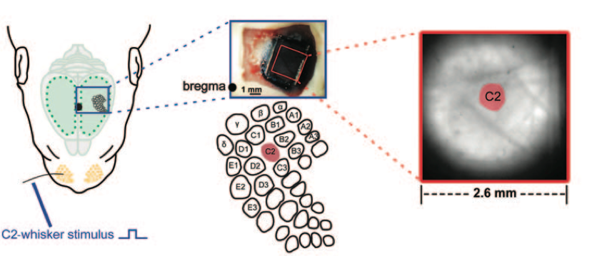
[Golshani et al][#Golshani:2009]       | 2P-MCI in mouse S1 **478 x 186 µm FOV**                                                                                                                                  | 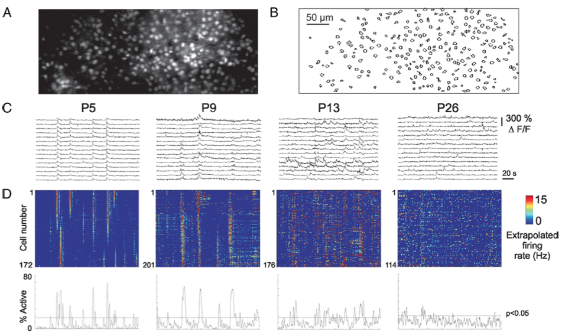
monkey and human                       | EEG performed prenatally [#Vanhatalo:2005][#Tolonen:2007], no fMRI prenatally, (or infant?) but has been done in children for resting state connectivity                  |                                                         

**Conclusion:** The 'meso–macro' scale activity patterns within and between the developing cortical hemispheres have not been reported in any species.

### Future work 
More detailed descriptions of the nature and the functions of these activity patterns can and should be performed in parallel in ongoing and future studies.  
For example:  
 
* What is the intra- vs sub- cortical nature of barrel cortex activity (E.M.'s work)
* What is the intra- vs sub- cortical nature of ongoing activity in motor- associational-, and other non-primary sensory cortical areas?
* Relationship of imaged patterns to EEG patterns described in other studies?
* Extent to which functional correlations reflect direct synaptic connections?
* Retinal wave drive of other areas?
* Ontogenetic relationships of localized calcium domains?
* Development profile through first postnatal weeks
* Chronic developmental profile in individuals?
* Aberrant activity patterns in developmental disorder and seizure models?

## Outline

### Intro or conclusion stuff 

- Neural activity, drugs, and birth defects
	- epilepsy
	- autism
- What is the activity?
     - instructive or permissive?
     - leinekukel and khazipov work [#Leinekugel:2002][#Khazipov:2004a]
     - ucla konnerth imaging work [#Golshani:2009][#Adelsberger:2005]
     - human occipital cortex and retinal wave paper [#Vanhatalo:2005][#Tolonen:2007][#Ackman:2012]
     - To understand the informational capacity of neural activty in the developing brain, the structural dynamics of persistent activity must be understood. 
     - completely random? Organized in space and time, and at what scale?
     - previous work on interneuron migration, axon growth (olavarria work) synaptic formation, and anatomical studies indicates significant development decisions are being made in first postnatal week

### Ongoing activity in developing isocortex is characterized by discrete domains

* Cortical column (mini/meso/super columns) history (20th century anatomists-- sherrington, valverde, rakic, etc). 
* Column physiology-- Hubel and Wiesel. Rodent V1?
* Developmental studies-- fetal monkey ODCs. 
* Rodent barrels (early anatomical emergence from TC input, functional/physiological emergence?). 
	* What is known about columns/domains in secondary/association/non-primary sensory representations? Rest of rodent S1 (non-barrel cortex?). 
* Calcium domains of Yuste, Science 1992 paper. [#Yuste:1992]
* Other slice calcium recordings, patch/gap junctions. In vivo physiology? (Not too many multisite electrode recordings in cortex, spatial resolution issue). 
* Calcium imaging-- Konnerth 'waves' in Ent cortex [#Adelsberger:2005]. For visual cortex, domains activity in extrastriate cortex (Ackman Nature 2012). But S1-- [#Golshani:2009] work in later postnatal-- but activity not obeying domains in barrel cortex-- problem with spatial sampling in the xy and the z for this study?

### Cortical activity is mirrored between the hemispheres

* Inter hemispheric functional connectivity, importance for autism, schizophrenia. Maybe an activity-dependent mechanism for commisural connectivity.
* olavarria work, evidence for inter hemispheric activity dependence
* [#Hanganu:2006], 30% of spindle bursts correlated across hemispheres
* Activity correlated in anterior-posterior and medial-lateral directions
* Mirror symmetric and non-mirror symmetric patterns
* Regional effects, more corr anticorr in certain regions?
* State dependent corr?

### Cortical domain activity is state dependent

* EEG slow oscillations not detectable until P10 in rodent.
* Previously demonstrated that general anesthesia abolishes spontaneous activity in visual system [#Ackman:2012]. 
* What about ongoing activity in other cortical areas during early brain development? Surgical procedure relevance.
* No population calcium activity found during gen'l anesthesia, only slow traveling waves.
* During anesthesia induction, rapid (<30 s) knock down of discrete domain activity (P3 mouse <120518_09.tif>). Cingulate, retrosplenial activations the last to go-- default mode/resting state network areas last.
<120518_09_mjpeg.mov>

### Conclusions

* **Ongoing activity in developing cortex is not random**-- specifically coordinated in space and time within and among cortical areas between the hemispheres
* BRAIN initiative
	- this work aids at least a couple of the 9 preliminary aims of the Brain project
* template for assessing altered functional dynamics in models for neurological disorders

## Workflow

Writing workflow will be similar to that used previously for [current opinion review][id3]. Some useful info in [currOpinRvw outline][id2].

Instructions for [converting multimarkdown to Word document][id4]

Image processing and dataset generation will utilize custom code in the [wholeBrainDX] software project. 

Datasets and R code for exploratory data analysis and graphics will live inside this wholeBrain project repository. Datasets and raw data too big to be inside this git repo will be stored on external servers and linked to accordingly.

[wholeBrain_main.md]: wholeBrain_main.md

[id2]: https://github.com/ackman678/currOpinRvw/blob/master/currOpin_outline.md

[id3]: https://github.com/ackman678/currOpinRvw/blob/master/README.md 

[id4]: https://gist.github.com/ackman678/6391902

[wholeBrainDX]: https://github.com/ackman678/wholeBrainDX/blob/master/README.md  

<<[references.txt]