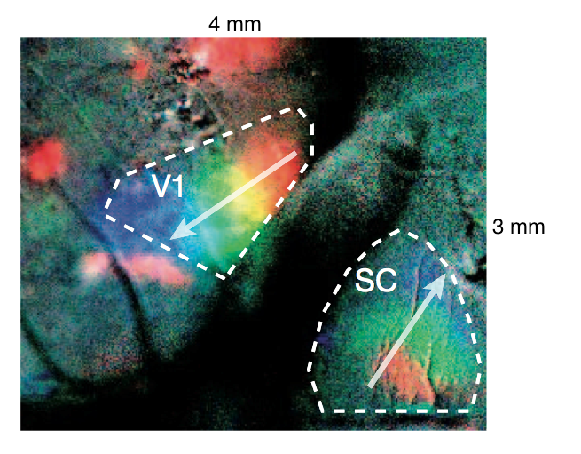

# wholeBrain imaging paper

The goal of this work is to provide a broad description of the population activity patterns that occur in developing cerebral cortex.

The main manuscript file is **[wholeBrain_main.md][]**

## Rationale
The idea is to provide a clear and beautiful representation of the visualized activity patterns within developing brain in vivo.

### Scientific importance
A comprehensive description of the spatiotemporal activity patterns in the immature brain will be crucial to understanding the developmental dynamics that exist between intrinsic and extrinsic factors that regulate circuit development. 

* signature patterns that predict current or future behavior
* construction of self-organizing circuits (advanced robotics -- *Terminators, Skynet, & Cylons!*)

### Human health importance
* neurodevelopmental disorders (autism, schizophrenia, epilepsy)
* activity-dependent structural plasticity. Implications for brain repair.
* development of brain-machine interfaces

### Previous work 

reference                              | FOV info                                                                                                                                                                  | figure snapshot                                       
-------------------------------------- | ------------------------------------------------------------------------------------------------------------------------------------------------------------------------- | ------------------------------------------------------  
[Chiu & Weliky][#Chiu:2001]            | linear MEA covering a **3.2 mm strip** across visual cortex Corr activity observed between cortical patches separated by mean distance of 1 mm                            | 
[Hanganu et al][#Hanganu:2006]         | single electrodes or 4 shank linear MEAs placed in each hemisphere (0.5-1.0mm spacing, for **1.5-3.0mm total**)                                                           | 
[Adelsberger et al][#Adelsberger:2005] | optical fiber implant for freely moving neonatal mice with bulk loading, 400µm diameter FOV imaged in TeA or Ent                                                         | 
[Rochefort et al][#Rochefort:2009]     | 100x70µm FOV 2P-MCI in mouse visual cortex at P11                                                                                                                        | 
[Colonnese et al.][#Colonnese:2010]    | single pulled electrodes in V1 or linear MEA (16 site silcon probe, 4sites x 4shanks, with 200µm separation, **600µm total**                                            | 
[Siegel et al.][#Siegel:2012]          | **219x180 µm FOV** 2P-MCI in visual cortex                                                                                                                               | 
[Ackman et al][#Ackman:2012]           | **3.0 x 4.0 mm FOV** WF-MCI in V1, V2, and SC P3-P9 mouse                                                                                                                 | 
[Leinekugel et al][#Leinekugel:2002]   | P4-6 rat hippocampus, cortex, 8 tip linear MEA (tungsten wires), 100-300µm vertical tip separation                                                                       | 
[Khazipov et al][#Khazipov:2004a]      | P1-6 rat somatosensory cortex, single electrode MUA and PC                                                                                                                | 
[Yang et al][#Yang:2009]               | 4x4 linear MEA 200µm spacing, **600µm total**, bilaterally in S1 barrel cortex                                                                                          | 
[Yang et al][#Yang:2012a]              | **2.6 x 2.6 mm FOV**, VSD imaging in S1 cortex P0-7 rat. Spont and evoked activity in C2 barrel. 8shank x 4site silicon probe linear MEA (200µm separation, 1.4mm total) | 
[Golshani et al][#Golshani:2009]       | 2P-MCI in mouse S1 **478 x 186 µm FOV**                                                                                                                                  | 
monkey and human                       | EEG performed prenatally [#Vanhatalo:2005][#Tolonen:2007], no fMRI prenatally, (or infant?) but has been done in children for resting state connectivity                  |                                                         

**Conclusion:** The 'meso–macro' scale activity patterns within and between the developing cortical hemispheres have not been reported in any species.

### Future work 
More detailed descriptions of the nature and the functions of these activity patterns can and should be performed in parallel in ongoing and future studies.  
For example:  
 
* What is the intra- vs sub- cortical nature of barrel cortex activity (E.M.'s work)
* What is the intra- vs sub- cortical nature of ongoing activity in motor- associational-, and other non-primary sensory cortical areas?
* Relationship of imaged patterns to EEG patterns described in other studies?
* Extent to which functional correlations reflect direct synaptic connections?
* Retinal wave drive of other areas?
* Ontogenetic relationships of localized calcium domains?
* Development profile through first postnatal weeks
* Chronic developmental profile in individuals?
* Aberrant activity patterns in developmental disorder and seizure models?

## Workflow

Writing workflow will be similar to that used previously for [current opinion review][id3]. Some useful info in [currOpinRvw outline][id2].

Instructions for [converting multimarkdown to Word document][id4]

Image processing and dataset generation will utilize custom code in the [wholeBrainDX] software project. 

Datasets and R code for exploratory data analysis and graphics will live inside this wholeBrain project repository. Datasets and raw data too big to be inside this git repo will be stored on external servers and linked to accordingly.

[wholeBrain_main.md]: wholeBrain_main.md

[id2]: https://github.com/ackman678/currOpinRvw/blob/master/currOpin_outline.md

[id3]: https://github.com/ackman678/currOpinRvw/blob/master/README.md 

[id4]: https://gist.github.com/ackman678/6391902

[wholeBrainDX]: https://github.com/ackman678/wholeBrainDX/blob/master/README.md  

<<[references.txt]