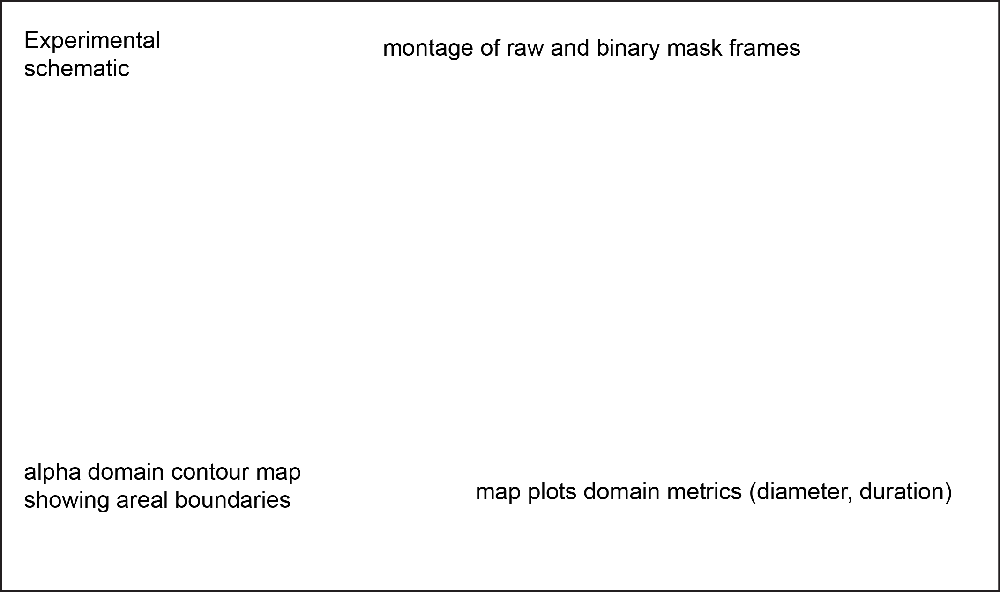
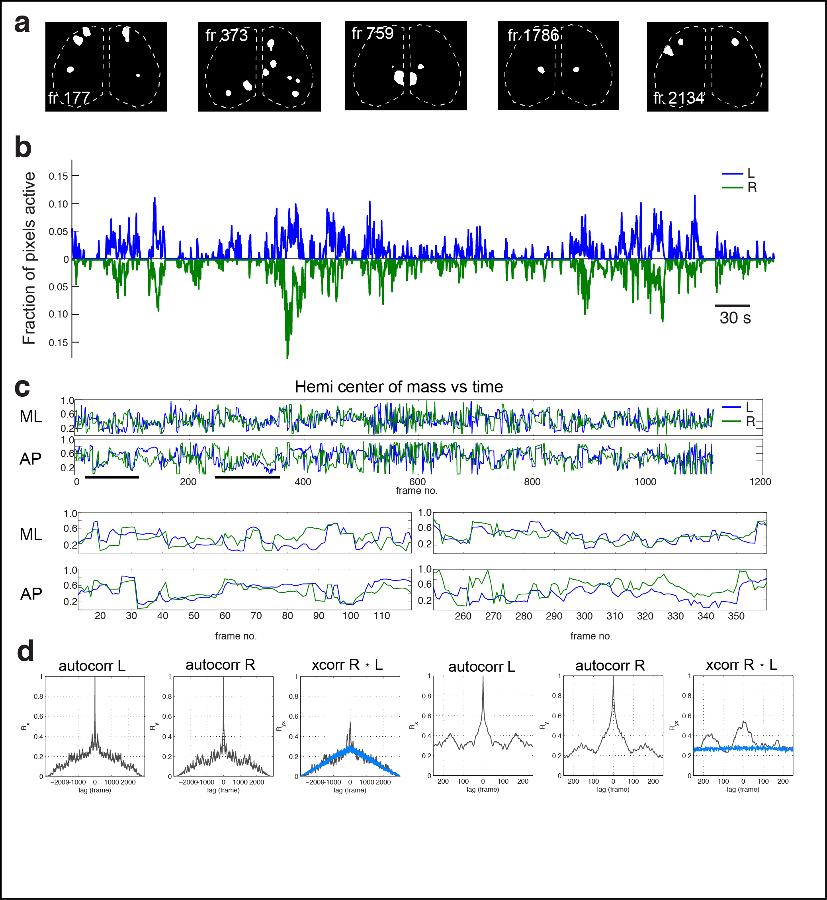
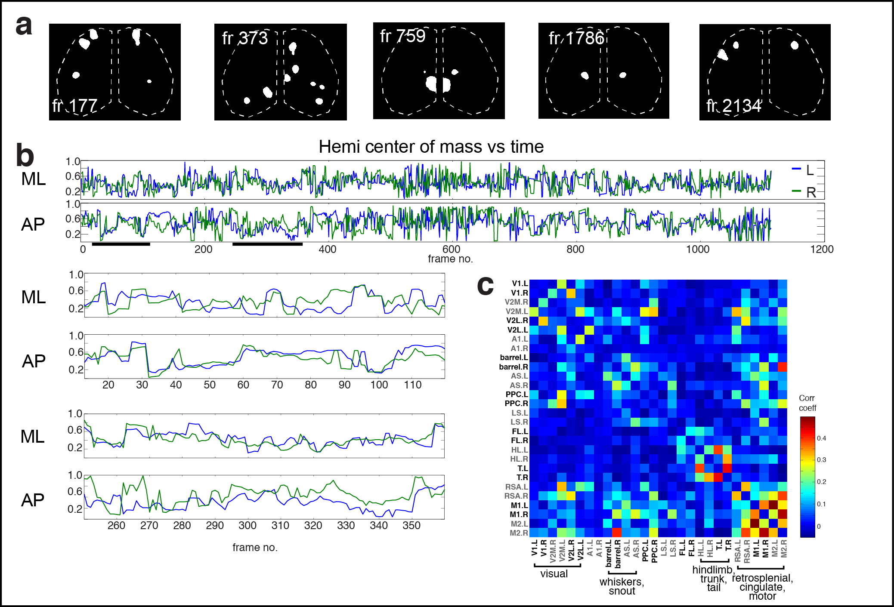

Author: James B. Ackman  
Date: 2013-09-04 10:54:02  
Tags: paper, draft, manuscript, literature, research, #results, retinal waves, spontaneous activity, development, calcium domains  

# Structured population activity across developing neocortex  

# Abstract  

The cerebral cortex exhibits spontaneous and sensory evoked patterns of activity during fetal and postnatal development that are crucial for the activity-dependent formation and refinement of circuits. Knowing the source and flow of these activity patterns locally and globally is crucial to understanding self-organization in the developing brain. Here we describe a system for imaging patterns of activity throughout the developing neocortex at the 'mesoscopic' level of resolution in transgenic mice expressing the genetic calcium indicator GCaMP3. Ongoing activity in the neonatal cerebral cortex was characterized by discrete and repetitively active domains measuring 100s of microns in diameter. This technique offers an unprecedented ability to study functional connectivity within and between the cerebral hemispheres at a scope and scale which bridges the microscopic or macroscopic resolutions offered by traditional neurophysiology and neuroimaging (fMRI) based recordings and will provide a practical means to assess cortical connectivity with high spatial resolution in pathophysiological models for autism, epilepsy, and schizophrenia.

# Introduction  

<!--- some of this intro material needs to be combined with abstract for a Nature letter --->

- Activity and development
- Neural activity, drugs, and birth defects
	- epilepsy
	- autism
- What is the activity?
     - instructive or permissive?
     - EEG slow oscillations not detectable until P10 in rodent.
     - slice work
     - leinekukel and khazipov work [#Leinekugel:2002][#Khazipov:2004a]
     - ucla konnerth imaging work [#Golshani:2009][#Adelsberger:2005]
     - human occipital cortex and my retinal wave paper [#Vanhatalo:2005][#Tolonen:2007][#Ackman:2012]
     - is the activity completely random? Or Is it organized in space and time, and at what scale?
     - the little that we know is from work in second postnatal week, not earlier, olavarria work, interneuon migration, synaptic formation, and anatomical studies indicates significant development decisions are being made in first postnatal week

# Results

## Ongoing activity in the developing cerebral cortex is characterized by discrete domains

* Cortical column (mini/meso/super columns) history (20th century anatomists-- sherrington, valverde, rakic, etc). 
* Column physiology-- Hubel and Wiesel. Rodent V1?
* Developmental studies-- fetal monkey ODCs. 
* Rodent barrels (early anatomical emergence from TC input, functional/physiological emergence?). 
	* What is known about columns/domains in secondary/association/non-primary sensory representations? Rest of rodent S1 (non-barrel cortex?). 
* Calcium domains of Yuste, Science 1992 paper. [#Yuste:1992]
* Other slice calcium recordings, patch/gap junctions. In vivo physiology? (Not too many multisite electrode recordings in cortex, spatial resolution issue). 
* Calcium imaging-- Konnerth 'waves' in Ent cortex [#Adelsberger:2005]. For visual cortex, domains activity in extrastriate cortex (Ackman Nature 2012). But S1-- [#Golshani:2009] work in later postnatal-- but activity not obeying domains in barrel cortex-- problem with spatial sampling in the xy and the z for this study?

Domains:  

Domain overlay:  

Domain stats:  

key | value | unit
--- | --- | ---
xmean | 388.6234 | µm
ymean | 394.9717 | µm
zmean | 0.63622 | s
xmax | 3178 | µm
ymax | 2383.5 | µm
zmax | 14.6 | s
xmin | 11.35 | µm
ymin | 22.7 | µm
zmin | 0.2 | s

2.8683 domains/sec

Temporal correlation of activity between the hemispheres:  

<!--

-->

## Cortical domain activity is state dependent  ##

* Previously demonstrated that general anesthesia abolishes spontaneous activity in visual system [#Ackman:2012]. 
* What about ongoing activity in other cortical areas during early brain development? Surgical procedure relevance.
* No population calcium activity found during gen'l anesthesia, only slow traveling waves.
* During anesthesia induction, rapid (<30 s) knock down of discrete domain activity (P3 mouse <120518_09.tif>). Cingulate, retrosplenial activations the last to go-- default mode/resting state network areas last.
<120518_09_mjpeg.mov>

### Cortical activity and motor activity is periodic

Even more zoomed in. 

Conclusions: The two hemispheres seem to be mostly synchronized, though it’s possible the R hemispshere (which is also the slightly more ‘active’ hemisphere, see stats table below) leads the left by a bit. The asymmetric peak at –150–175frames is interesting. That would be about 30–35 sec.

The big secondary peaks around ±30 sec is present in both autocorrs and xcorrs and is far above the random normal xcorr baseline (blue trace). In fact there is a periodicity seen in the autocorrs and the xcorrs where there is a dampening oscillation about on this interval! (See ideal dampening frequency in random sine wave example above). This corresponds to a 1/30sec == 0.033 Hz ultra-slow oscillation.

Looking at the above plot showing lags from [–1000, 1000] frames which is ± 200 s, we can see about 5.5 cycles of this underlying dampening oscillation in both autocorr plots. This corresponds to (1000fr*0.2sec/fr)/5.5 => 36.36 sec/cycle => 0.0275 cycles/sec or ~0.03 Hz

### Cortical activity is correlated with the motor signal

### Percentage of cortical activity which exhibits corr with motor signal?

lenActvFraction>0 | fracCorr | timeCorr_s | fracCorrPos | timeCorrPos_s | fracCorrNeg | timeCorrNeg_s
 --- | --- | --- | --- | --- | --- | ---
2161 | 0.30032 | 129.8 | 0.27441 | 118.6 | 0.025914 | 11.2

### Cross-correlation of cortical activity and motor activity
xcorr for whole. 

xcorr during motor period. 

## Cortical activity is mirrored between the hemispheres ##

* Inter hemispheric functional connectivity, importance for autism, schizophrenia. Maybe an activity-dependent mechanism for commisural connectivity.
* [#Hanganu:2006], 30% of spindle bursts correlated across hemispheres
* Activity correlated in anterior-posterior and medial-lateral directions
* Mirror symmetric and non-mirror symmetric patterns
* Regional effects, more corr anticorr in certain regions?
* State dependent corr?

<!--
* sensory input required or stimulation experiments?
* Each hemisphere 'training' the other one in preparation for behaviorally relevant sensory-motor imitations '[[mirror_neurons]]' hypothesis?  -->

xy pearson corr coef ML | xy pearson corr coef AP
--- | ---
p = 1.1591e-28 | p = 7.0982e-07

 | 

**Conclusions:** So the activity in both hemispheres at postnatal day 3 (P3) clearly exhibits significant spatial correlations in  both in the medial-lateral and anterior-extent. This is consistent with and complementary to the fact that the active pixel fraction in each hemisphere exhibits a strong temporal correlation as I found earlier in this report [Temporal correlation of activity][]. The medial-lateral positional correlation is stronger than the anterior-posterior (higher *R* and lower *p* value).   The total number of coactive frames is `numel(y1(~isnan(y1)&~isnan(y2)))` == **1114 frames**. This is accounts to **37.13%** of the movie or **222.8 s**. Cortex.L had 1635 actvFrames and cortex.R had 1677 actvFrames which means that each hemisphere was coactive with the other hemisphere 1114/1635 == **68.13%** and 1114/1677 == **66.43%** of the active time respectively. 

<!--- # References --->

<<[references.txt]

